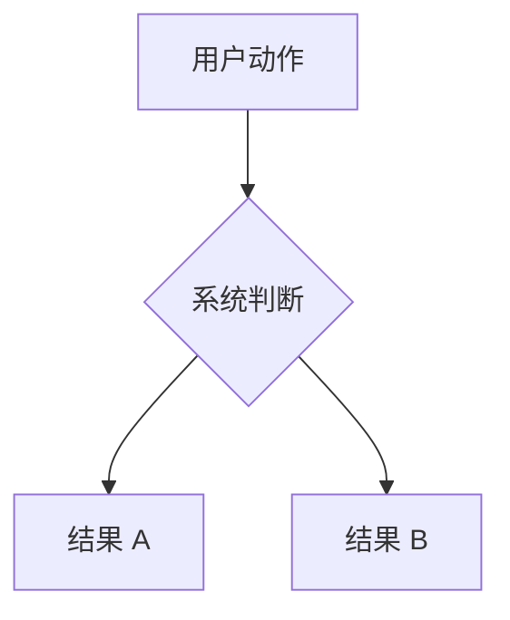

# 文档贡献指南

这页写给准备改 AsterDrive 文档的人，同时覆盖用户文档（`docs/`，发布在 <https://drive.astercosm.com/>）和开发者文档（`developer-docs/`，发布在 <https://drive.astercosm.com/developer/>）两套站点的规则。我们希望每一页都能帮读者完成一个明确任务，所以新增内容前先确认它应该放在哪条阅读路径里。

## 先判断放在哪里

用户文档按读者任务分层：

| 你要写什么 | 放哪里 | 例子 |
| --- | --- | --- |
| 第一次使用、快速开始、部署方式选择 | `start/` | 快速开始、常用流程、第一个管理员 |
| 日常操作、普通用户任务 | `using/` | 文件整理、上传下载、分享、WebDAV 使用、账号安全 |
| 管理员场景流程 | `admin/` | 用户与团队、注册登录 SSO、邮件、存储策略与策略组、预览处理、离线下载、自定义前端 |
| 具体存储后端接入教程 | `admin/storage-backends/` | 本地磁盘、S3 / MinIO / R2、Azure Blob Storage、腾讯云 COS、OneDrive、SFTP、远程节点存储策略 |
| 部署、上线、升级、备份、排障、监控 | `deploy/` + `ops/` | Docker、systemd、反向代理、多实例、故障排查、运维 CLI |
| `config.toml` 字段、后台系统设置选项 | `reference/config/` | 服务器、数据库、部署模式、系统设置各分组 |
| 概念解释、能力矩阵、协议兼容、索引、问题分流 | `reference/` | 运行架构、存储能力矩阵、WebDAV 协议兼容、术语表、错误码 |
| 源码模块、设计契约、协议内部行为 | `developer-docs/`（本站） | 架构概览、模块设计、服务所有权、design/ 契约 |

拿不准时，先问一句：**读者打开这页是为了完成什么任务？**

- 是“我想用这个功能” → `using/`
- 是“我要接一个具体后端，或走一个管理场景” → `admin/`
- 是“我要让服务稳定跑起来” → `deploy/` + `ops/`
- 是“我要改哪个配置、查某个字段含义” → `reference/config/`
- 是“我看不懂词 / 不知道查哪里 / 想了解项目” → `reference/`
- 是“我要改代码，先搞清模块边界” → `developer-docs/`

## 新增存储后端教程

存储后端教程放在用户文档 `admin/storage-backends/`，一页只讲一种后端，按“准备后端服务 -> 创建存储策略 -> 配置策略组 -> 绑定测试用户或团队 -> 验收”的流程写。

内置 connector 的身份、展示名称、部署范围、凭据模式和传输能力以运行时 `StorageConnector` descriptor 与 connector localization 为准。`tests/storage_connector_docs.rs` 通过管理 API 读取这份 catalog，并生成：

- `docs/generated/storage-connectors.json`：机器可读、随 PR 审查的 manifest
- `docs/src/content/docs/admin/storage-backends/index.md` 中的后端选择表
- `docs/src/content/docs/admin/storage-policies.md` 中的 connector catalog
- `docs/src/content/docs/reference/storage-matrix.md` 中的能力矩阵
- 上述三处英文页面的对应 block

`docs/astro.config.mts` 直接从 manifest 构造存储后端侧边栏，不再维护第二份 backend 列表。新增或改名内置 connector 时：

1. 修改 connector descriptor、本地化资源和 `tests/storage_connector_docs.rs` 中 provider-owned 的教程 slug / 适用场景摘要。
2. 新增中英文 provider 教程。
3. 运行 `make storage-docs`，审查 manifest 和 Markdown 生成 diff。
4. 运行 `make storage-docs-check`；CI 也会执行同一漂移检查。

生成 block 由 `storage-connectors:*:start/end` 标记包围，不手动编辑。后端总览、策略 catalog 和能力矩阵是穷举入口；README、部署说明、故障排查和教程里的 provider 名称只作上下文示例，必须写成“例如 / 等”而不是暗示完整清单。上下文示例不随每个新 connector 机械扩写。

如果只改某个后端的细节，不要复制另一篇教程的大段内容；把共通模型链接到存储策略与策略组页（`/admin/storage-policies/`）或能力矩阵（`/reference/storage-matrix/`）。

## 侧边栏是一条阅读流程

用户文档站用 Astro Starlight 构建，没有顶栏下拉菜单，全站导航就是固定侧边栏，不按目录切换。它的目标是让读者始终知道整本文档的结构。

新增文档优先加到固定侧边栏的阅读流程里，按读者第一次需要它的位置插入，不要按文件名排序。

默认顺序：

1. 开始
2. 使用
3. 管理
4. 部署
5. 运维
6. 参考与项目

新增页面时，按读者第一次需要它的位置插入，不要按文件名排序。

## 术语要和 UI 一致

文档里优先使用产品界面上的中文叫法。必要时第一次出现可以补英文或内部名。

推荐写法：

- `远程节点`，必要时解释它是 follower
- `主控节点`，必要时补 `primary`
- `从节点`，必要时补 `follower`
- `远程存储目标`
- `存储策略`
- `策略组`
- `系统设置`
- `公开站点地址`
- `预览应用`
- `审计日志`

尽量不要在同一页里混用多套名字，比如一会儿叫“从节点”，一会儿叫“follower 实例”，一会儿又叫“远程存储实例”。第一次解释清楚后，后文保持同一个叫法。

## 页面开头先帮读者定位

长页开头最好有三样东西：

- 这页覆盖什么
- 什么时候该看这页
- 去哪里操作，或者先看哪张速查表

推荐结构（页面标题写在 frontmatter 里，正文从二级标题开始）：

```md
---
title: 页面标题
---

:::tip[这一篇覆盖什么]
一句话说明边界。避免在本页重复相邻页面的大段内容。
:::

## 入口速查

| 你想做什么 | 去哪里 |
| --- | --- |
| ... | ... |
```

## 链接规则

用户文档站内链接优先用绝对路径：

```md
[系统设置](/reference/config/runtime/)
[远程节点](/admin/follower-nodes/)
[故障排查](/ops/troubleshooting/)
```

同目录短链接也能用，但跨目录建议避免 `../guide/...` 这类相对路径。绝对路径更容易阅读，后续移动文件时也更稳。

开发者文档内部链接用相对 `.md` 路径（在 GitHub 上也能点击），构建脚本会把它们映射成发布路由；从开发者文档指回用户文档的链接用完整 URL（`https://drive.astercosm.com/...`）。

## 写法规则

- 先给结论，再给细节
- 用表格做速查，用列表做步骤
- 配置项、路径、命令用反引号
- 危险操作用 `:::caution[标题]`
- 可选背景知识用 `<details><summary>标题</summary>`
- 不写还没合并的功能承诺
- 不为了“完整”复制另一页的大段内容，应该链接过去

## 流程图规则

流程、拓扑、数据路径这类图优先用 Mermaid：



简单的后台入口、路径、配置值、命令输出仍然用 `text` 代码块，不要为了单行内容硬画图。

Mermaid 图默认支持点击放大。普通文档视图里要保持紧凑，节点文字尽量短；长说明放在图下正文里，不要塞进节点。

## 开发者文档的额外规则

开发者文档（`developer-docs/`）和用户文档的写法有几处不一样：

- 源文件以 `# 一级标题` 开头，**不写 frontmatter**；构建脚本会提取标题和首段作为页面 title 和 description。
- 内部链接用相对 `.md` 路径，构建时自动映射到 `/developer/` 路由。
- `records/` 目录是草稿和历史快照，文件必须显式标注状态（草稿 / 历史快照），不作为当前实现依据。
- 改完用 `bun run developer-docs:build` 验证，而不是 `docs:build`。

工程工作流文档还要保持单一职责：

- `architecture/project-contract.md` 只写长期产品边界、工程不变量和完成标准，不枚举容易漂移的当前模块清单。
- `contributing/engineering-workflow.md` 只写从接收任务到交付、自迭代的执行流程，不复制各子系统设计。
- `contributing/task-routing.md` 只写任务到文档、代码入口和最低验证的映射，不把实现细节展开成第二份架构文档。
- 具体模块当前长什么样写进 `architecture/`，子系统契约写进 `design/`，测试环境和命令写进 `testing/`。
- 同一规则已经有权威页面时，其他入口只保留一句摘要和链接，避免以后同步三份相似文字。

## 版本化怎么运转

线上用户文档按分支版本化，不是按构建快照：

- `release/x.y` 分支承载每个已发布小版本的文档。根路径 `/` 是最新 release 分支的文档，`/vX.Y/` 是旧版本，`/next/` 是 master 开发版
- 每次发布 release，CI 自动从 tag 切出对应的 `release/x.y` 分支；任何 push 到 `master` 或 `release/**` 的文档改动都会触发全量重建，所以所有版本的导航和版本切换器始终是新的
- 修旧版本文档：直接往对应的 `release/x.y` 分支提交（或 cherry-pick），CI 会重建该版本。没有分支的远古版本（如 0.1、0.2）自动用该小版本最后一个 tag 构建
- 版本清单完全由 git 解析（`docs/scripts/resolve-versions.sh`）：tag 决定有哪些版本，`release/x.y` 分支存在时优先于 tag。不维护任何静态版本表
- 本地想看完整版本化站点：

```bash
bun run docs:preview:all
```

它会按 CI 同样的逻辑在本地构建所有版本（`/next/` 用的是你当前工作区，含未提交改动）并起本地预览。

## 中英同步策略

中文版是主版本，英文版允许滞后。

- PR 只改中文是可以接受的，但请在 PR 描述里标注“英文版未同步”，方便维护者后续补译
- 改了技术事实（端口、路径、配置项、错误码、版本号）时，中英两边必须同步，不能一边改了另一边留着旧值
- 拿不准英文措辞时，宁可先只改中文，也不要两边写出不一致的事实

## 错误码改动要过检查

改 `src/api/api_error_code.rs` 或 `errors.md` 时，本地先跑：

```bash
bun docs/scripts/check-error-codes.mjs
```

它会对比代码里的全量错误码和错误码文档：文档引用了不存在的错误码会直接失败；代码新增但文档未提及的会列成警告清单。CI 也会对这两个路径的改动跑同一检查。

## 改完必须验证

改完用户文档至少跑：

```bash
bun run docs:build
```

改完开发者文档至少跑：

```bash
bun run developer-docs:build
```

如果改了导航、logo、侧边栏或首页，最好再跑：

```bash
bun run docs:dev
```

然后自己点一遍：

- 首页入口
- 固定侧边栏折叠
- 新增页面
- 编辑本页链接
- 深色 / 浅色 logo

文档能构建只是底线，还需要实际预览一遍，确认读者能顺着入口和侧边栏找到内容。
