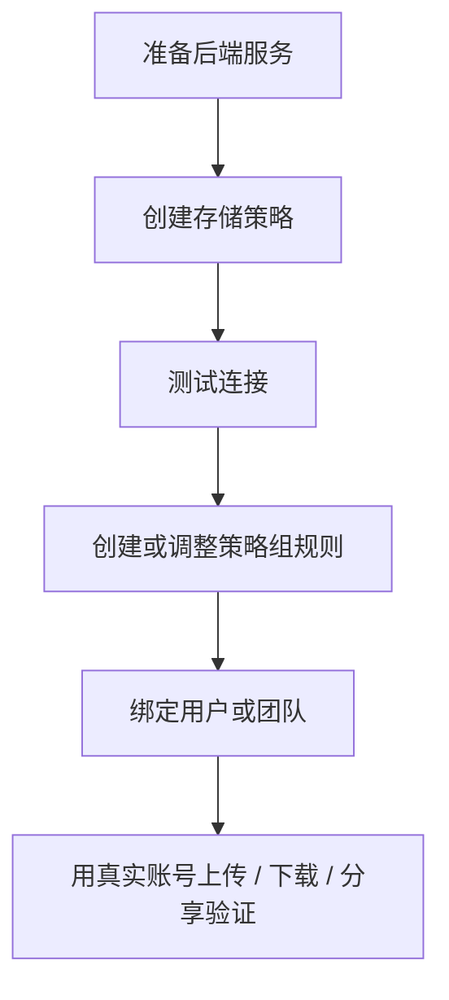

:::tip[这一类文档讲什么]
这里按"后端类型"写教程：怎么准备外部服务、怎么创建存储策略、怎么配置策略组规则、怎么把用户或团队切过去，以及上线前怎么验收。
存储策略和策略组的两层概念本身，权威说明在 [存储策略与策略组](/admin/storage-policies/)。
:::

## 后端怎么选

<!-- storage-connectors:index:start -->
| 后端 | Connector ID | 部署范围 | 适合场景 | 教程 |
| --- | --- | --- | --- | --- |
| 本机 | `asterdrive.storage.local` | 单实例本地 | 单机、NAS、小团队、最少依赖 | [本机](/admin/storage-backends/local/) |
| S3 | `asterdrive.storage.s3` | Primary 间共享 | S3 兼容对象存储、外部 bucket 和大文件 | [S3](/admin/storage-backends/s3/) |
| 阿里云 OSS | `asterdrive.storage.alibaba_oss` | Primary 间共享 | 阿里云 OSS 原生 V4 签名、内外网 endpoint 分流或 CNAME | [阿里云 OSS](/admin/storage-backends/alibaba-oss/) |
| SFTP | `asterdrive.storage.sftp` | Primary 间共享 | SSH/SFTP 文件服务器和服务端流式读写 | [SFTP](/admin/storage-backends/sftp/) |
| Azure Blob | `asterdrive.storage.azure_blob` | Primary 间共享 | Azure Storage account 和 Blob container | [Azure Blob](/admin/storage-backends/azure-blob/) |
| 腾讯云 COS | `asterdrive.storage.tencent_cos` | Primary 间共享 | 腾讯云 COS 和按策略启用的 COS 数据万象 | [腾讯云 COS](/admin/storage-backends/tencent-cos/) |
| 远程节点 | `asterdrive.storage.remote` | Primary 间共享 | 由另一台 AsterDrive follower 节点保存对象 | [远程节点](/admin/storage-backends/remote-follower/) |
| OneDrive | `asterdrive.storage.onedrive` | Primary 间共享 | Microsoft 365、OneDrive、SharePoint 和 group drive | [OneDrive](/admin/storage-backends/onedrive/) |
| 七牛云 Kodo | `asterdrive.storage.qiniu` | Primary 间共享 | 带官方 endpoint 诊断的七牛云 Kodo S3 空间 | [七牛云 Kodo](/admin/storage-backends/qiniu-kodo/) |
<!-- storage-connectors:index:end -->

多 Primary（cluster profile）的默认策略必须由所有 Primary 访问，`local` 不能作为默认策略；详见 [存储策略与策略组](/admin/storage-policies/#第一次启动后默认会有什么)。

各后端的直传能力、容量观测、原生处理和凭据模式对比，以及 `relay_stream` 与 `presigned` 怎么选，见 [存储能力矩阵](/reference/storage-matrix/)。

## 通用配置流程

## 先别急着切生产流量

新的后端建议先单独建一条策略，不要直接改正在使用的旧策略。

推荐做法：

1. 新建后端策略
2. 新建测试策略组
3. 绑定一个测试用户或测试团队
4. 上传、下载、分享、删除、恢复各跑一遍
5. 确认没有问题后，再把真实用户或团队迁到新策略组

:::caution[已写入文件的策略，不要直接改真实落点]
`local` 的目录、S3 / OSS 的 bucket / endpoint / prefix、Azure Blob 的 endpoint / container / 基础路径、OneDrive 的 drive / root item / site 或 group 定位字段、SFTP 的 endpoint / 基础路径、远程节点绑定，这些字段决定旧文件在哪里。直接改掉，旧文件可能会找不到。正确的搬迁方式见 [存储策略与策略组](/admin/storage-policies/#迁移已有策略数据)。
:::
