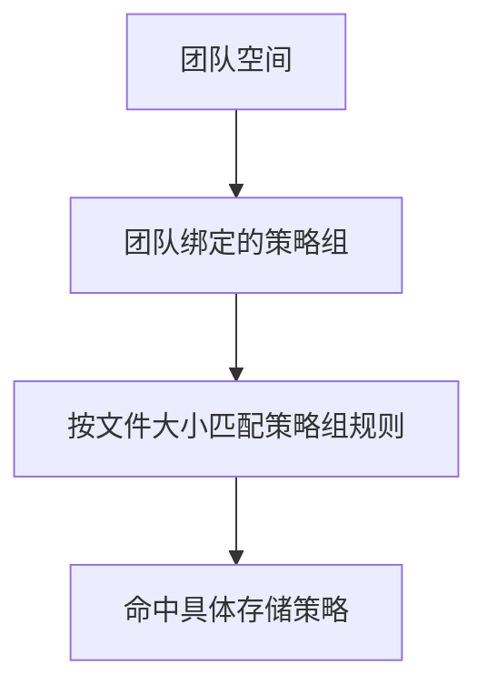

:::tip[这一篇讲什么]
系统管理员视角的用户和团队管理：`管理 -> 用户` 和 `管理 -> 团队` 能做什么、创建团队的推荐顺序、归档语义和排查顺序。
普通用户怎么加入团队、切换工作空间，见 [工作空间与团队](/using/workspaces-teams/)；注册、登录和 SSO 策略见 [注册、登录与 SSO](/admin/auth-sso/)。
:::

## 用户管理

`管理 -> 用户` 负责账号层面的日常管理。

你可以在这里：

- 创建用户
- 搜索和筛选用户
- 调整角色和启用状态
- 修改总配额
- 给用户绑定策略组
- 打开用户详情继续处理

在用户详情里，还可以继续做这些事：

- 重置这个用户的登录密码
- 要求这个用户下次登录后立即修改密码
- 重置这个用户的 MFA
- 强制让这个用户当前所有设备重新登录
- 查看当前空间占用和配额

系统会保护初始管理员账号，避免你误把唯一的管理员停用、降级或删除。

### 强制下次登录改密

如果管理员为用户启用"强制下次登录改密"，系统会让该用户现有登录会话立即失效。用户下一次通过密码、MFA、Passkey 或外部认证完成登录后，只能进入强制改密页面；在输入当前密码（若管理员已重置则为临时密码）并设置新密码之前，不能访问文件、团队、管理后台等普通功能。改密成功后，这个要求会自动清除，并记录审计日志。

### 重置 MFA

重置 MFA 适用于用户丢失认证器和恢复码的场景。这个操作会清除该用户的认证器、恢复码和未完成的 MFA 登录流程，同时让该用户当前会话失效；用户下次登录后需要重新绑定认证器。
用户自己管理 MFA、Passkey 和登录设备的入口，见 [账号与安全](/using/account-security/)。

## 团队管理

`管理 -> 团队` 是系统管理员视角，负责团队工作空间的创建、归档、恢复和全局维护：

- 创建团队
- 指定初始团队管理员
- 给团队绑定一个可用策略组
- 查看团队列表、成员数、空间占用和归档状态
- 修改团队名称、描述、配额和策略组
- 归档、恢复或删除团队
- 查看团队审计日志
- 在必要时介入成员管理

团队创建完成后，系统管理员继续在这里做全局维护；团队里的管理员和所有者，在 `设置 -> 团队` 里继续做团队内部管理。系统管理员不等于每个团队的日常协作者——团队内部的日常成员管理，优先交给团队所有者或团队管理员。

:::tip[权限排查先看两层]
一个用户能不能操作团队内容，先看他是不是团队成员，再看他在团队里的角色。不要只看他是不是系统管理员。
:::

### 创建团队的推荐顺序

1. 在 `管理 -> 策略组` 确认是否已有适合团队使用的策略组
2. 到 `管理 -> 团队` 创建团队
3. 填写团队名称和描述
4. 选择初始团队管理员
5. 设置团队配额
6. 绑定策略组
7. 创建后进入团队详情，补充成员

如果暂时不确定团队要走哪条存储路线，可以先使用默认策略组。后续切换策略组时，新的上传会按新规则走；已经写入的旧文件仍按原存储策略读取。

### 团队和策略组

团队不是直接绑定某条存储策略，而是绑定**策略组**。团队上传文件时走的链路：



常见做法：

- 小团队直接使用默认策略组
- 大文件较多的团队单独走 S3 / MinIO / 腾讯云 COS / 华为云 OBS 策略组
- 异地团队单独走远程节点策略组
- 临时项目团队设置较小配额和独立策略组

修改团队策略组前，先确认目标策略组启用中，并且里面至少有一条可用规则。策略组本身的配置见 [存储策略与策略组](/admin/storage-policies/)。

### 归档和恢复团队

归档团队适合这些场景：

- 项目结束，但暂时不想删除内容
- 团队暂停使用
- 需要把团队从日常列表里收起来

归档后，团队不会像正常团队那样继续作为日常工作空间使用。如果后续需要恢复，系统管理员可以在 `管理 -> 团队` 里恢复团队。

团队归档保留时间在：

```text
管理 -> 系统设置 -> 存储与保留 -> 团队归档保留时长
```

:::caution[归档不是备份]
归档只是产品内状态，不替代数据库和文件对象备份。长期保留或合规留存仍然要走 [备份与恢复](/ops/backup/)。
:::

## 排查团队相关问题的顺序

团队相关问题优先看：

- `管理 -> 团队 -> 团队详情`
- 团队详情里的成员列表
- 团队审计日志
- `管理 -> 审计日志`
- `管理 -> 任务`

常见排查顺序：

1. 用户是不是团队成员
2. 用户在团队里的角色是否足够
3. 当前工作空间是不是目标团队
4. 团队是否已归档
5. 团队绑定的策略组是否可用
6. 相关分享、任务或回收站项目是否属于同一个团队空间

如果用户说"我找不到刚才的分享"或"任务中心没有任务"，先确认他当前切到的是不是创建内容时的同一个工作空间。工作空间边界见 [工作空间与团队](/using/workspaces-teams/)。
