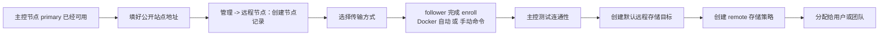

:::tip[适用场景]
把另一台 AsterDrive 跑成 `follower`，给主控节点提供远程对象存储落点——比如把家里的 NAS、另一台 VPS 或另一机房的机器接成存储节点。
:::

:::note[不适用场景]

- 想给主控扩容、承载更多普通用户请求 → follower 不承载用户流量，看 [负载均衡与多实例](/deploy/multi-instance/)
- 主控实例本身还没跑起来 → 先按 [部署概览](/deploy/) 选一条主控部署路径
- 只想要普通对象存储 → 直接用 [S3 / MinIO / R2 存储策略](/admin/storage-backends/s3/)，不需要 follower

:::

## 概念速览

- **主控节点（primary）**：负责登录、前端、管理后台、分享、WebDAV、存储策略和远程节点管理
- **从节点（follower）**：只暴露 `/health`、`/health/ready` 和内部远程存储协议；接收主控签名后的对象请求，按主控下发的**远程存储目标**把对象落到本地目录或 S3

当前内部远程存储协议版本是 `v5`，主控兼容 `v4` 到 `v5` 的 follower；`v2` / `v3` follower 需要先升级。

完整的概念边界（从节点能不能登录、远程存储目标能不能套 remote 等）见 [远程节点](/admin/follower-nodes/)。

## 前置条件

### 1. 主控节点已经正常运行

- 主控后台可以正常打开
- `管理 -> 系统设置 -> 站点配置 -> 公开站点地址` 已经填成真实可访问的 HTTP(S) 来源；多来源配置时，follower 能访问到的主控来源应放第一行——enroll 信息使用第一行作为主控地址
- 你已经想好这个 follower 的名称和传输方式

### 2. follower 必须有自己独立的 `data/`

主控和 follower **绝对不能共用** `data/config.toml`、数据库、上传目录或临时目录。从节点不是"主控的另一个副本"，它是另一台独立的 AsterDrive。

### 3. 先决定传输方式

| 传输方式 | `base_url` 怎么填 | 适合场景 |
| --- | --- | --- |
| 直连 | 必须填写主控能访问到的 follower HTTP(S) 地址 | 同机房、同内网、VPN、已有反向代理 |
| 反向通道 | 可以留空 | follower 只能主动访问主控，主控不能回连 follower |
| 自动 | 填了 `base_url` 就走直连；留空就走反向通道 | 想先按地址有无决定路线 |

`auto` 不会在直连失败后自动改走反向通道，它只看 `base_url` 是否为空。

如果远程策略要使用 `presigned` 上传或下载，必须使用直连，并确保浏览器也能访问 follower 的 `base_url`。反向通道当前只适合 `relay_stream`。

:::caution[反向通道仍处于测试阶段]
反向通道依赖 follower 能访问主控的 `公开站点地址`，并且中间代理、防火墙不要拦截 WebSocket 或长连接。如果你的网络已经能让主控稳定访问 follower，生产环境优先用直连，排障更简单。
:::

网络拓扑（公网、Tailscale / VPN、Docker 网络、反向通道）怎么选，以及 `base_url` 对主控和浏览器分别意味着什么，见 [从节点网络部署方式](/deploy/follower-node/network/)。

### 4. token 是一次性的

主控后台生成的 enrollment token 默认 **30 分钟**过期，成功兑换一次后就作废。

## 接入流程总览



:::tip[最容易漏的一步]
enroll 成功不等于可以上传。真正承接远程存储前，还要在主控节点给这个从节点创建默认远程存储目标。
:::

## 路径 A：Docker 自动 enroll（推荐）

Docker follower 支持在容器启动时直接读取 bootstrap ENV 自动完成 enroll，不再手动 `docker exec ... aster_drive node enroll`，也不需要 enroll 后额外重启。

### A1. 在主控后台创建远程节点并生成 token

入口：

```text
管理 -> 远程节点
```

先创建一条远程节点记录，至少填好名称、传输方式和 `base_url`（直连必填；反向通道可以留空）。保存后，后台会生成一组 enroll 信息。Docker follower 启动时真正需要的是 `master_url` 和 `token` 两个值。

### A2. 准备 follower 的数据目录

如果你用 bind mount，把宿主机目录先建好并改属主：

```bash
mkdir -p ./data
sudo chown -R 10001:10001 ./data
```

如果你用 named volume，可以跳过这一步。

### A3. 写 `compose.yaml`

下面这份示例假设 follower 对外暴露在宿主机 `3001` 端口：

```yaml
services:
  asterdrive-follower:
    image: ghcr.io/astercommunity/asterdrive:latest
    container_name: asterdrive-follower
    ports:
      - "3001:3000"
    environment:
      ASTER__SERVER__HOST: 0.0.0.0
      ASTER__SERVER__START_MODE: follower
      ASTER__SERVER__FOLLOWER__REMOTE_STORAGE_TARGET_LOCAL_ROOT: /data/remote-storage-targets
      ASTER__DATABASE__URL: sqlite:///data/asterdrive.db?mode=rwc
      ASTER_BOOTSTRAP_REMOTE_MASTER_URL: https://drive.example.com
      ASTER_BOOTSTRAP_REMOTE_ENROLLMENT_TOKEN: enr_replace_me
    volumes:
      - ./data:/data
      - /etc/localtime:/etc/localtime:ro
    restart: unless-stopped
```

这里最容易混在一起的是两类环境变量：

- `ASTER__...`：**长期运行配置覆盖**，和 `config.toml` 同一套结构，建议保留需要长期生效的项
- `ASTER_BOOTSTRAP_REMOTE_*`：**一次性 bootstrap 输入**，首次 enroll 成功后建议移除

| 环境变量 | 作用 | 建议 |
| --- | --- | --- |
| `ASTER__SERVER__HOST` | 让容器内服务监听所有网卡，方便 Docker 端口映射 | Docker 场景通常保留 |
| `ASTER__SERVER__START_MODE` | 把实例切成 `follower` 模式 | 从节点长期保留 |
| `ASTER__SERVER__FOLLOWER__REMOTE_STORAGE_TARGET_LOCAL_ROOT` | 限制主控下发的 `local` 远程存储目标根目录 | 需要本地远程存储目标时保留 |
| `ASTER__DATABASE__URL` | 指定 follower 自己的数据库 | Docker 场景建议显式写清楚 |
| `ASTER_BOOTSTRAP_REMOTE_MASTER_URL` | 首次 enroll 时访问的主控地址 | 成功后移除 |
| `ASTER_BOOTSTRAP_REMOTE_ENROLLMENT_TOKEN` | 主控生成的一次性 enrollment token | 成功后移除 |

:::tip[bootstrap ENV 要成对出现]
`ASTER_BOOTSTRAP_REMOTE_MASTER_URL` 和 `ASTER_BOOTSTRAP_REMOTE_ENROLLMENT_TOKEN` 必须一起设置。只设置其中一个，服务会在启动早期提示配置不完整；两个都不设置，就按普通 follower 启动，不会自动 enroll。
:::

### A4. 首次启动

```bash
docker compose up -d
docker logs -f asterdrive-follower
```

正常情况下，首次启动会依次完成：

1. 在 `/data/config.toml` 不存在时自动生成配置
2. 以 `follower` 模式启动
3. 用 `ASTER_BOOTSTRAP_REMOTE_MASTER_URL` 和 `ASTER_BOOTSTRAP_REMOTE_ENROLLMENT_TOKEN` 去主控兑换 bootstrap 信息
4. 在本地数据库写入主控绑定
5. 继续完成 follower 运行时初始化

你应该能在日志里看到类似信息：

- `Configuration loaded from: /data/config.toml`
- `bootstrapped follower enrollment from environment`
- `startup complete — listening on 0.0.0.0:3000`

### A5. 验证 follower 已经 ready

```bash
docker ps
curl http://127.0.0.1:3001/health
curl http://127.0.0.1:3001/health/ready
```

期望 `/health` 和 `/health/ready` 都返回 `200`。然后回主控后台 `管理 -> 远程节点` 点击"测试连接"：直连节点会访问 `base_url`；反向通道节点会通过 follower 主动建立的通道访问，刚启动时可能需要等几十秒让通道变成在线。

测试连接通过时，主控也会读取 follower 的内部存储协议能力，双方声明的协议版本范围有交集才能继续。

### A6. 首次成功后，把一次性 bootstrap ENV 移掉

确认 follower 已经 ready、主控测试连接通过后，把 `ASTER_BOOTSTRAP_REMOTE_MASTER_URL` 和 `ASTER_BOOTSTRAP_REMOTE_ENROLLMENT_TOKEN` 从 Compose 里删掉，再执行 `docker compose up -d`。

数据库里的主控绑定已经持久化；`ASTER__SERVER__START_MODE=follower` 这种长期运行配置仍然保留。

## 路径 B：二进制 / systemd 手动 enroll

### B1. 准备从节点实例

从节点和主控节点是同一个 `aster_drive` 二进制，只是运行模式不同。最少要确认：

- 它有自己的工作目录和数据卷
- 它的 `[server].start_mode` 是 `follower`
- 如果要用主控下发的本地远程存储目标，`[server.follower].remote_storage_target_local_root` 指向容量合适的目录

最直接的写法是修改 `config.toml`：

```toml
[server]
start_mode = "follower"

[server.follower]
remote_storage_target_local_root = "remote-storage-targets"
```

systemd 部署也可以用环境变量覆盖，写法见 [单实例 systemd 部署](/deploy/systemd/#把这台服务跑成从节点)。

<details>
<summary>当前目录里还没有 `config.toml` 怎么办？</summary>

`aster_drive node enroll` 在当前目录还没有配置文件时，会按 follower 模式生成一份默认 `data/config.toml`，并同时初始化数据库状态。

但你至少要先决定：

- 这个目录是不是以后服务真正运行的工作目录
- 这个目录下面的 `data/` 会不会被持久化

避免在临时目录完成 enroll 后，systemd 或 Docker 实际使用另一套数据卷。
</details>

### B2. 在主控节点登记远程节点

在 `管理 -> 远程节点` 创建记录，填好名称、传输方式和 `base_url`。保存后，后台会生成一条一次性命令，形态大概像这样：

```bash
aster_drive node enroll --master-url https://drive.example.com --token enr_xxxxx
```

### B3. 到从节点执行 enroll

进入从节点自己的工作目录后，执行刚才那条命令。如果要显式指定数据库，可以追加参数：

```bash
aster_drive node enroll \
  --master-url https://drive.example.com \
  --token enr_xxxxx \
  --database-url sqlite:///data/asterdrive.db?mode=rwc
```

这条命令会用 token 去主控节点兑换一次性的 bootstrap 配置，在从节点本地写入主控绑定（对象隔离前缀由 follower 自动生成），并把 enroll 回执写回主控节点。

注意，这一步**不会自动创建远程存储目标**。远程存储目标由主控节点在远程节点详情里下发：管理员后续要在同一个地方看到它、改它、测试它，也避免后续需要在 follower 机器上回溯当时的 CLI 参数。

如果当前配置还是 `primary` 模式，CLI 会直接报错，并要求你先把 `start_mode` 改成 `follower`。这是预期保护行为，用于避免把普通主控实例误接成从节点。

### B4. 重启从节点服务，再回主控测试

当前版本里，enroll 把主控绑定写进数据库后，**运行中的从节点服务不会自动热刷新**。所以流程一定是：

1. 执行 `node enroll`
2. 重启从节点服务
3. 回主控节点点击"测试连接"

这里有个很容易误判的地方：

| 接口 | enroll 前 | enroll 后 |
| --- | --- | --- |
| `/health` | 返回 `200` 代表进程活着 | 仍然应该返回 `200` |
| `/health/ready` | 返回 `503` 是正常的，因为还没有启用中的主控绑定 | 重启并接入成功后应返回 `200` |

enroll 前 `/health/ready` 返回 `503` 不代表服务故障，它本来就尚未进入 ready 状态。

## 创建默认远程存储目标

测试连接通过后，回到 `管理 -> 远程节点`，打开这台 follower，找到**远程存储目标**。这里决定主控写到 follower 的对象最后落在哪里。

当前支持两类远程存储目标：

- `local`：写入 follower 本地目录
- `s3`：写入 follower 能访问的 S3 / MinIO / R2 这类对象存储

第一次建议创建 `local`：名称填容易识别的名字（如 `default-local`），基础路径填相对路径（如 `default`），勾选"设为默认远程存储目标"。

这里的本地路径**只能是相对路径**，始终被限制在 follower 的 `server.follower.remote_storage_target_local_root` 下面——`base_path = "default"` 最终会落到 follower 的 `data/remote-storage-targets/default` 这一类目录。如果你想让 follower 直接把对象写到 S3，也是在这里新建 `s3` 远程存储目标，填 endpoint、bucket、凭证和可选前缀。

:::caution[没有默认远程存储目标，远程写入会被拒绝]
enroll 成功只代表主从身份绑定成功。真正接收对象前，follower 还需要一个已应用的默认远程存储目标，否则远程策略上传时会返回"还没有默认远程存储目标"。
:::

远程存储目标由主控节点通过 follower API 下发，前提：

- 直连节点必须填了主控可访问的 `base_url`
- 反向通道或 `auto + 空 base_url` 节点必须已经显示通道在线
- follower 只绑定一套 AsterDrive 控制面身份；cluster 中的多个 Primary 必须共享数据库、静态密钥和同一套公开/LB 入口，不能把同一 follower 同时绑定给多个彼此独立的 AsterDrive 部署

## 创建 remote 存储策略

回到主控节点 `管理 -> 存储策略`，新建 `远程节点` 类型的存储策略。它和本地 / S3 策略最大的区别：

- 真正的网络传输、访问密钥和签名都由"远程节点"记录负责
- 策略本身只负责远端路径前缀、上传限制，以及是否设为默认
- 远程存储策略应绑定**已接入、已启用，并且当前传输方式可用**的远程节点
- follower 真正写到哪里，由上一步绑定到策略的远程存储目标决定；没有显式选择时使用默认目标

完整的策略组分流、测试用户绑定和上线验收步骤见 [远程节点存储策略教程](/admin/storage-backends/remote-follower/)。

## `presigned` 的额外要求

主控会按策略的上传/下载方式校验 follower 能力：

- 基础读写需要对象 `GET`、`HEAD`、`PUT`、`DELETE`
- 文件夹和对象维护需要 `list`、`compose`、`metadata`
- 预览、续传和流式读取需要 `range_get` 和 `accept_ranges_header`
- 使用远程 `presigned` 上传或下载时，还需要 `browser_presigned_cors`，并且远程节点不能走反向通道

选择远程 `presigned` 时浏览器会直接访问 follower，所以必须使用直连传输，浏览器也必须能访问 follower 的 `base_url`，follower 前面的反向代理不能把内部存储 API 的 CORS 头吞掉：

- 上传至少要求允许请求头 `content-type`、暴露响应头 `ETag`
- 下载至少要求允许请求头 `range`、暴露响应头 `Accept-Ranges`、`Content-Range`、`Content-Length`

当前 follower 默认声明的浏览器 CORS 契约会覆盖 `content-type, range`，并暴露 GET 所需的 `Accept-Ranges`、`Cache-Control`、`Content-Disposition`、`Content-Length`、`Content-Range`、`Content-Type`、`ETag`，以及 PUT 所需的 `ETag`。

## 上线验收

至少完成这些验证：

1. follower 的 `/health` 和 `/health/ready` 都返回 `200`
2. 主控后台"测试连接"通过，能力摘要里协议版本范围与主控兼容
3. 默认远程存储目标已创建并应用成功
4. 用 remote 策略实际上传一个文件，确认对象落到 follower 的预期目录或 S3 bucket
5. 实际下载一次，确认链路完整
6. 如果选择了 `presigned`，用真实浏览器各验证一次上传和下载；`relay_stream` 正常但 `presigned` 失败时，优先查浏览器到 follower `base_url` 的 DNS、证书、路由、CORS 和代理响应头
7. Docker 路径确认一次性 bootstrap ENV 已移除

## 日常维护

- follower 的升级和备份与普通实例相同，按各自部署方式处理；主控和 follower 的版本协议兼容范围是 `v4` 到 `v5`
- 禁用远程节点会实际停止链路：主控的远程策略停止使用它，从节点也拒绝对应的签名入站请求
- 日常容量和连接状态可以从主控后台远程节点详情查看

## 常见故障

### 日志里提示 token 已完成、已过期或已被替换

你拿的是旧 token。回主控后台重新生成一条新的 enrollment token，再更新 Compose 或重新执行 enroll。

### `/health` 是 200，但 `/health/ready` 还是 503

通常表示 follower 进程活着，但主控绑定还没有生效。优先检查：

- bootstrap ENV 有没有写对
- token 有没有过期
- follower 本地数据库里是否真的写入了绑定
- 日志里是否出现 bootstrap 失败 warning

如果还没有执行过 enroll，`/health/ready` 返回 `503` 本来就是正常状态。

### follower 能启动，但主控测试连接失败

优先检查：

- 远程节点传输方式是不是选对了
- 直连模式下，主控后台里填的 `base_url` 是不是主控真正能访问到的地址
- 反向通道模式下，follower 能不能访问主控的 `公开站点地址`，代理或防火墙有没有拦 WebSocket / 长连接
- 直连模式下，端口映射、反向代理或 NAT 有没有把流量正确转到 follower 的 `3000`
- follower 的 `server.host` 是否允许外部访问
- 主控跑在 Docker 里时，容器内是否真的解析得到 follower 地址（见 [从节点网络部署方式](/deploy/follower-node/network/)）

### 已有旧的 `/data/config.toml`，里面还是 `primary`

最稳的做法有两个：

- 直接在 `/data/config.toml` 里把 `[server].start_mode` 改成 `follower`
- 或者长期保留 `ASTER__SERVER__START_MODE=follower` 环境变量覆盖

bootstrap token 不会自动把既有 `primary` 配置改为 `follower`。如果启动时已经带了 `ASTER_BOOTSTRAP_REMOTE_*`，但最终加载出来的模式仍然是 `primary`，服务会停止并提示先切到 `follower`，这是为了避免把主控实例误接成从节点。
