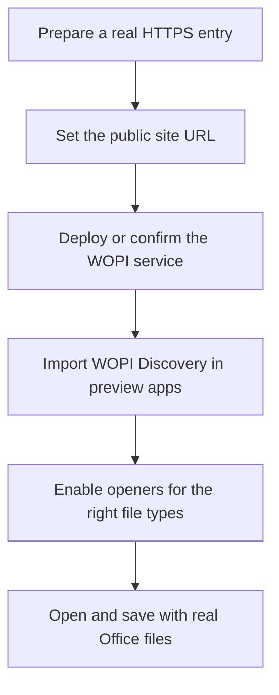

:::tip[What this page covers]
The administrator's view: how to configure extra openers for files — especially handing Office files to OnlyOffice, Collabora, or another WOPI-compatible service — plus the backend switches for image, archive, and audio/video previews.
For how regular users use these openers, see [Preview and Editing](/en/using/preview-editing/).
:::

## The Three Opener Types

| Type | Best for | Key requirement |
| --- | --- | --- |
| Built-in previewers | Types covered by built-in capability: images, PDF, text, video, archive manifests, etc. | Provided by AsterDrive itself; some capabilities are further gated by system settings |
| URL template previewers | Handing a file preview link to an external web page | The external page can reach the preview link AsterDrive generates |
| WOPI openers | Online preview or editing of Office files | The WOPI service can call back into AsterDrive's WOPI API |

The most common use of WOPI is opening `docx`, `xlsx`, and `pptx` files in OnlyOffice or Collabora. AsterDrive handles file access, sessions, tokens, and locks; the actual Office editing UI comes from the external WOPI service.

## Recommended Onboarding Order



## Where the Entries Are

Administrator entry:

```text
Admin -> System Settings -> Site -> Preview Apps
```

Related configuration:

```text
Admin -> System Settings -> Site -> Public Site URL
Admin -> System Settings -> Network Access
```

For reverse proxy notes, see [Reverse Proxy](/en/deploy/reverse-proxy/).

## Why `Public Site URL` Matters Most

When a WOPI service opens a file, the browser does not read the local file directly. The WOPI service takes the WOPI URL AsterDrive issued and calls back into AsterDrive to read file info and content.

So `Public Site URL` must be:

- A real HTTP(S) origin
- HTTPS in production, recommended
- Reachable from the environment running the WOPI service
- Added individually for every real entry in multi-domain deployments

Each entry is origin-only, no path:

```text
https://drive.example.com
```

Do not write:

```text
https://drive.example.com/api
```

## Common Patterns in Docker Networks

If AsterDrive and OnlyOffice / Collabora are both in Docker, two common routes:

| Route | Public site URL | Best when |
| --- | --- | --- |
| Both via public domain | `https://drive.example.com` | Reverse proxy and certificates are ready |
| Internal domain callback | `https://drive.internal.example.com` | The WOPI service is internal and can resolve the internal domain |

Do not set `Public Site URL` to `http://localhost:3000`.
To the WOPI service, `localhost` usually means its own container or host, not AsterDrive.

## Importing via WOPI Discovery

If your WOPI service offers a discovery address, prefer creating openers by import.

It typically looks like:

```text
https://office.example.com/hosting/discovery
```

After import, AsterDrive generates openers from the app information discovery returns. You still need to confirm:

- The right file extensions are enabled
- Opener ordering matches expectations
- Each opener is preview or edit as intended
- Popup vs new-tab behavior fits your site's habits

If the WOPI service updates its discovery content, you may need to re-import or wait for the discovery cache to expire. The cache duration is in the WOPI-related system settings.

## When to Use URL Template Previewers

URL template previewers fit "handing an accessible file preview link to an external web page".

How they differ from WOPI:

- URL templates usually do not save back
- The external service mostly just receives a file URL
- The other side must be able to reach that URL
- Intranet addresses, `localhost`, and plain HTTP links often fail

The built-in Microsoft / Google previewers follow this model. They fit publicly accessible file preview scenarios, and are not a general editing solution for private deployments.

## Built-in Image Preview

When an image opens, AsterDrive chooses between two sources:

- The original image, if the browser can render it directly
- A medium WebP preview generated and cached by the backend

The default strategy is configured at:

```text
Admin -> System Settings -> File Processing -> Media Processing -> Image Preview Strategy
```

`Prefer original` suits sites that want the raw file whenever possible; `prefer medium preview` suits sites with many large photos or sensitive bandwidth, or sites that want a fast preview first and the original on demand. Either way, if the browser cannot render the original format, it falls back to the backend preview.

When a backend preview is missing for the first time, an `image_preview_generate` background task is created; until it finishes, the page may show a loading or fallback state, and later opens reuse the cache.

## Read-Only Archive Preview

AsterDrive has a built-in archive preview, but it is off by default. Administrators need to check both:

```text
Admin -> System Settings -> File Processing -> Archive Preview
Admin -> System Settings -> Site -> Preview Apps
```

It is a **read-only manifest preview**:

- Currently supports ZIP
- Reads archive metadata and shows folders, files, sizes, and modification times
- Does not extract the archive into the user's folder
- Does not offer downloads of individual files inside the archive
- Is not a replacement for "online extraction"

Administrators can separately control:

- The archive preview master switch
- Whether signed-in users may preview in personal and team workspaces
- Whether public share pages may preview
- Limits on source archive size, entry count, manifest size, and scan duration

:::caution[Be careful with the share-side switch]
Share-page archive preview shows the archive's internal paths, file names, sizes, and modification times to visitors. Even visitors who have not downloaded the archive can see this metadata. Enable share-side preview only if you accept that behavior.
:::

If an archive fails to open, check first:

- Is the archive preview master switch on
- Is the current entry user-side or share-side, and is the matching switch on
- Is the file a supported ZIP, not `rar`, `7z`, or another format
- Does the source archive exceed the size limit
- Has the `archive preview generation` task failed under `Admin -> Tasks`

For the user-side explanation of filename encoding options (`Auto`, `GB18030`, `CP437`, `Shift_JIS`, etc.), see [Preview and Editing](/en/using/preview-editing/#read-only-archive-preview).

## Audio and Video Preview

For signed-in users, audio and video previews read from the current storage policy and support browser Range requests. On public share pages, audio and video first create a short-lived streaming session, then point the player at that temporary address.

This session is valid for `3` hours by default; administrators can adjust it at:

```text
Admin -> System Settings -> Runtime -> Share Streaming Session TTL
```

It is not the share link's own expiry. The share's password, expiry, and max download count are still validated as usual; the streaming session is only a temporary Range address for the browser player.

## Saves, Version History, and Locks

When WOPI saves back into AsterDrive, it is treated as an overwrite write:

- A successful save generates a historical version
- A lock appears while the file is being edited; some client or protocol scenarios allow multiple shared locks on the same resource
- While a valid lock exists, conflicting overwrites, moves, or deletes are rejected
- Expired locks are cleaned up in the background, and administrators can clean them manually
- For locks stuck after abnormal exits, administrators can go to `Admin -> Locks`

Whether WOPI supports multi-user collaboration depends on the external service you connect. AsterDrive provides files, tokens, sessions, and locks per the WOPI protocol; it does not implement the collaborative editing UI for the external Office service.

## When CORS Needs Changing

Most WOPI callback problems are not CORS — they are the WOPI service being unable to reach `Public Site URL`.

Only adjust this when the browser console clearly shows AsterDrive API cross-origin errors:

```text
Admin -> System Settings -> Network Access -> Allowed Cross-Origin Sources
```

If OnlyOffice / Collabora backend requests to AsterDrive are failing, check networking, DNS, certificates, and the reverse proxy first.

## Pre-launch Validation

Test with real Office files:

1. `docx` opens
2. `xlsx` opens
3. `pptx` opens
4. After saving, the file content updates in AsterDrive
5. The new version appears in version history
6. The lock releases after the editor closes
7. The same file types behave as expected on share pages or in team workspaces

If you only intend to offer preview, not editing, also confirm the UI button labels and behavior match expectations, so users do not think they can save.

## Common Problems

### The opener does not appear

Check first:

- Is the preview app enabled
- Is the file extension covered by this app
- Does the current user have permission to read the file
- Is this opener shadowed by another one in the preview app ordering

### White screen after opening

The most common cause is the WOPI service failing to call back into AsterDrive. Check:

- Is `Public Site URL` really reachable
- Can the WOPI service container or host resolve this domain
- Is the TLS certificate trusted by the WOPI service
- Does the reverse proxy pass through `/api/v1/wopi/`

### Opens but saving fails

Check first:

- Does the file still exist
- Does the user still have write permission
- Has the WOPI access token expired
- Are system clocks correct on both the WOPI service and AsterDrive
- Are there abnormal locks under `Admin -> Locks`

### Built-in Microsoft / Google previewers fail to open

They usually require the external service to reach the file preview link. Private intranets, `localhost`, untrusted certificates, or plain HTTP deployments can all fail. For private deployments that need online editing, connecting your own WOPI service is the recommended route.
