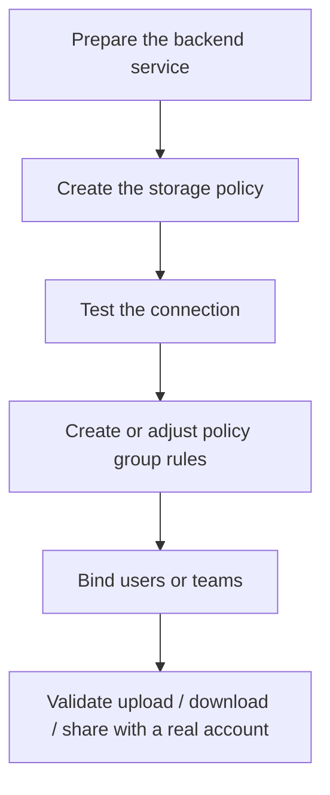

:::tip[What this section covers]
Tutorials here are organized by **backend type**: how to prepare the external service, create the storage policy, configure policy group rules, move users or teams over, and validate before going live.
The two-layer concept of storage policies and policy groups itself lives in [Storage Policies and Policy Groups](/en/admin/storage-policies/).
:::

## Choosing a Backend

<!-- storage-connectors:index:start -->
| Backend | Connector ID | Deployment scope | Best for | Tutorial |
| --- | --- | --- | --- | --- |
| Local | `asterdrive.storage.local` | Instance-local | Single machine, NAS, small teams, minimal dependencies | [Local](/en/admin/storage-backends/local/) |
| S3 | `asterdrive.storage.s3` | Shared across Primary instances | S3-compatible object storage, external buckets, and large files | [S3](/en/admin/storage-backends/s3/) |
| Alibaba Cloud OSS | `asterdrive.storage.alibaba_oss` | Shared across Primary instances | Alibaba Cloud OSS with native V4 signing, split endpoints, or CNAME | [Alibaba Cloud OSS](/en/admin/storage-backends/alibaba-oss/) |
| SFTP | `asterdrive.storage.sftp` | Shared across Primary instances | SSH/SFTP file servers and server-side streaming | [SFTP](/en/admin/storage-backends/sftp/) |
| Azure Blob | `asterdrive.storage.azure_blob` | Shared across Primary instances | Azure Storage accounts and Blob containers | [Azure Blob](/en/admin/storage-backends/azure-blob/) |
| Tencent COS | `asterdrive.storage.tencent_cos` | Shared across Primary instances | Tencent COS and per-policy COS CI processing | [Tencent COS](/en/admin/storage-backends/tencent-cos/) |
| Remote | `asterdrive.storage.remote` | Shared across Primary instances | Objects stored by another AsterDrive follower node | [Remote](/en/admin/storage-backends/remote-follower/) |
| OneDrive | `asterdrive.storage.onedrive` | Shared across Primary instances | Microsoft 365, OneDrive, SharePoint, and group drives | [OneDrive](/en/admin/storage-backends/onedrive/) |
| Qiniu Kodo | `asterdrive.storage.qiniu` | Shared across Primary instances | Qiniu Cloud Kodo buckets through its S3-compatible API | [Qiniu Kodo](/en/admin/storage-backends/qiniu-kodo/) |
<!-- storage-connectors:index:end -->

For multi-Primary (cluster profile) deployments, the default policy must be reachable by every Primary, and `local` cannot be the default policy; see [Storage Policies and Policy Groups](/en/admin/storage-policies/#what-exists-after-first-start).

For each backend's direct-upload capability, capacity observation, native processing, and credential mode — plus how to choose between `relay_stream` and `presigned` — see the [Storage Capability Matrix](/en/reference/storage-matrix/).

## Shared Onboarding Flow

## Do Not Switch Production Traffic Yet

For a new backend, create a separate new policy; do not edit the old policy that is in use.

Recommended approach:

1. Create the backend policy
2. Create a test policy group
3. Bind a test user or test team
4. Run upload, download, share, delete, and restore end to end
5. Only then migrate real users or teams to the new policy group

:::caution[Do not edit the real landing location of a policy that already has files]
The `local` directory, S3 / OSS bucket / endpoint / prefix, Azure Blob endpoint / container / base path, OneDrive drive / root item / site / group targeting fields, SFTP endpoint / base path, and the bound remote node all decide where old files live. Change them in place and old files may become unfindable. For the correct move procedure, see [Storage Policies and Policy Groups](/en/admin/storage-policies/#migrating-existing-policy-data).
:::
