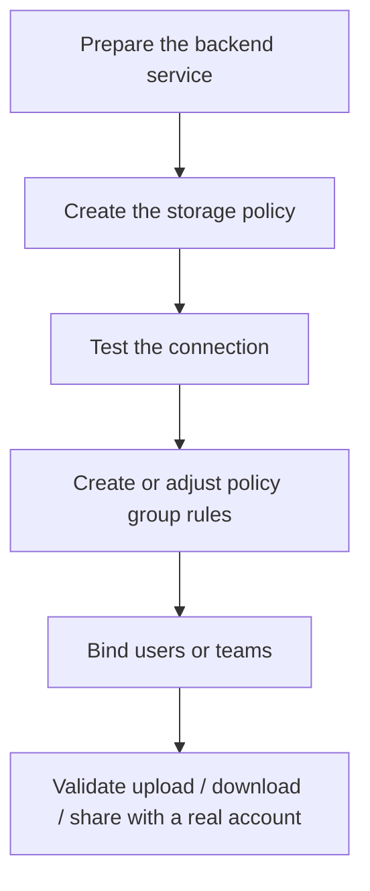

:::tip[What this section covers]
Tutorials here are organized by **backend type**: how to prepare the external service, create the storage policy, configure policy group rules, move users or teams over, and validate before going live.
The two-layer concept of storage policies and policy groups itself lives in [Storage Policies and Policy Groups](/en/admin/storage-policies/).
:::

## Choosing a Backend

| Backend | Best for | Tutorial |
| --- | --- | --- |
| Local Disk | Single machine, NAS, small teams, minimal dependencies | [Local Disk](/en/admin/storage-backends/local/) |
| S3 / MinIO / R2 | Object storage, large files, external buckets, cloud storage | [S3 / MinIO / R2](/en/admin/storage-backends/s3/) |
| Alibaba Cloud OSS | Native Alibaba OSS buckets, OSS V4 signing, public/internal endpoint split, or CNAME | [Alibaba Cloud OSS](/en/admin/storage-backends/alibaba-oss/) |
| Azure Blob Storage | Azure Storage accounts, Blob containers, Azure-managed object storage | [Azure Blob Storage](/en/admin/storage-backends/azure-blob/) |
| Tencent Cloud COS | Tencent Cloud object storage, COS CI, per-policy native processing | [Tencent Cloud COS](/en/admin/storage-backends/tencent-cos/) |
| Huawei Cloud OBS | Native `SignatureObs`, regional endpoints, custom domains, OBS multipart, and presigned URLs | [Huawei Cloud OBS](/en/admin/storage-backends/huawei-obs/) |
| OneDrive | Microsoft 365, OneDrive, SharePoint / group drives, Microsoft Graph authorization | [OneDrive](/en/admin/storage-backends/onedrive/) |
| SFTP | SSH/SFTP file servers, NAS, traditional server directories, server-side streaming | [SFTP](/en/admin/storage-backends/sftp/) |
| Remote Node | Control plane on the primary, real objects written to another AsterDrive | [Follower Node Storage Policy](/en/admin/storage-backends/remote-follower/) |

For multi-Primary (cluster profile) deployments, the default policy must be reachable by every Primary, and `local` cannot be the default policy; see [Storage Policies and Policy Groups](/en/admin/storage-policies/#what-exists-after-first-start).

For each backend's direct-upload capability, capacity observation, native processing, and credentials at rest — plus how to choose between `relay_stream` and `presigned` — see the [Storage Capability Matrix](/en/reference/storage-matrix/).

## Shared Onboarding Flow

## Do Not Switch Production Traffic Yet

For a new backend, create a separate new policy; do not edit the old policy that is in use.

Recommended approach:

1. Create the backend policy
2. Create a test policy group
3. Bind a test user or test team
4. Run upload, download, share, delete, and restore end to end
5. Only then migrate real users or teams to the new policy group

:::caution[Do not edit the real landing location of a policy that already has files]
The `local` directory, S3 / OSS / OBS bucket / endpoint / prefix, Azure Blob endpoint / container / base path, OneDrive drive / root item / site / group targeting fields, SFTP endpoint / base path, and the bound remote node all decide where old files live. Change them in place and old files may become unfindable. For the correct move procedure, see [Storage Policies and Policy Groups](/en/admin/storage-policies/#migrating-existing-policy-data).
:::
