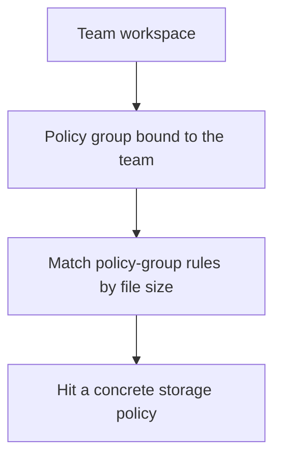

:::tip[What this page covers]
User and team management from the system administrator's perspective: what `Admin -> Users` and `Admin -> Teams` can do, the recommended team-creation order, archive semantics, and troubleshooting order.
For how regular users join teams and switch workspaces, see [Workspaces and Teams](/en/using/workspaces-teams/); for registration, login, and SSO policy, see [Registration, Login and SSO](/en/admin/auth-sso/).
:::

## User Management

`Admin -> Users` handles day-to-day account-level administration.

You can:

- Create users
- Search and filter users
- Adjust roles and enabled state
- Change total quotas
- Bind policy groups to users
- Open a user's detail page for further actions

From the user detail page, you can also:

- Reset this user's login password
- Require this user to change password at next login
- Reset this user's MFA
- Force all of this user's current devices to sign in again
- View current space usage and quota

The system protects the initial administrator account, so you cannot accidentally disable, demote, or delete the only administrator.

### Forced Password Change at Next Login

When an administrator enables "force password change at next login" for a user, that user's existing sessions are invalidated immediately. The next time the user completes sign-in via password, MFA, Passkey, or external auth, they land on a forced password-change page only; until they enter the current password (a temporary one if the administrator reset it) and set a new one, normal features like files, teams, and the admin console stay unavailable. After a successful change, the requirement clears automatically and an audit log entry is recorded.

### Resetting MFA

Resetting MFA covers the case where a user lost both the authenticator and all recovery codes. The operation clears the user's authenticator, recovery codes, and any unfinished MFA login flows, and invalidates their current sessions; the user re-binds an authenticator after their next login.
For where users manage MFA, Passkeys, and login devices themselves, see [Account and Security](/en/using/account-security/).

## Team Management

`Admin -> Teams` is the system administrator's view, responsible for creating, archiving, restoring, and globally maintaining team workspaces:

- Create teams
- Designate the initial team administrator
- Bind an available policy group to a team
- View the team list, member counts, space usage, and archive state
- Change team name, description, quota, and policy group
- Archive, restore, or delete teams
- View team audit logs
- Intervene in member management when necessary

After a team is created, the system administrator keeps doing global maintenance here; team owners and team administrators continue day-to-day internal management under `Settings -> Teams`. A system administrator is not automatically a day-to-day collaborator in every team — prefer letting team owners and team administrators handle routine member management.

:::tip[Check two layers first for permission issues]
Whether a user can operate team content depends first on whether they are a team member, then on their team role. Do not judge solely by whether they are a system administrator.
:::

### Recommended Team-Creation Order

1. Under `Admin -> Policy Groups`, confirm a policy group suitable for the team already exists
2. Go to `Admin -> Teams` and create the team
3. Fill in team name and description
4. Choose the initial team administrator
5. Set the team quota
6. Bind the policy group
7. After creation, open the team detail page and add members

If you are unsure which storage route the team should take, start with the default policy group. When you switch policy groups later, new uploads follow the new rules; files already written keep reading from the original storage policy.

### Teams and Policy Groups

A team does not bind a storage policy directly — it binds a **policy group**. Uploads in a team space follow this chain:



Common patterns:

- Small teams use the default policy group directly
- Teams with many large files get their own S3 / MinIO / Tencent COS / Huawei Cloud OBS policy group
- Geo-distributed teams get their own remote-node policy group
- Temporary project teams get a smaller quota and a dedicated policy group

Before changing a team's policy group, confirm the target group is enabled and has at least one usable rule. For policy group configuration itself, see [Storage Policies and Policy Groups](/en/admin/storage-policies/).

### Archiving and Restoring Teams

Archiving fits these scenarios:

- The project ended, but you do not want to delete the content yet
- The team is paused
- You want the team out of the daily list

An archived team no longer serves as a day-to-day workspace. If you need it back later, a system administrator can restore it under `Admin -> Teams`.

Team archive retention lives at:

```text
Admin -> System Settings -> Storage and Retention -> Team Archive Retention
```

:::caution[Archiving is not backup]
Archiving is only an in-product state. It does not replace database and file-object backups. Long-term retention or compliance preservation still goes through [Backup and Restore](/en/ops/backup/).
:::

## Troubleshooting Order for Team Issues

Look at these first for team-related problems:

- `Admin -> Teams -> Team Detail`
- The member list inside team detail
- Team audit logs
- `Admin -> Audit Logs`
- `Admin -> Tasks`

Standard troubleshooting order:

1. Is the user a team member
2. Is the user's team role sufficient
3. Is the current workspace the target team
4. Is the team archived
5. Is the team's bound policy group usable
6. Do the relevant shares, tasks, or recycle-bin items belong to the same team workspace

If a user says "I can't find the share I just created" or "the task center shows nothing", first confirm they have switched to the same workspace where the content was created. For workspace boundaries, see [Workspaces and Teams](/en/using/workspaces-teams/).
