:::tip[Who this scenario is for]
Run another AsterDrive instance as a `follower` to provide remote object storage for your primary node — for example, attaching a home NAS, a second VPS, or a machine in another datacenter as a storage node.
:::

:::note[When not to use this scenario]

- Want to scale the primary for more user traffic -> followers do not serve user traffic; see [Load Balancing and Multi-Instance Deployments](/en/deploy/multi-instance/)
- The primary instance is not running yet -> pick a primary deployment path from the [Deployment Overview](/en/deploy/) first
- Just want plain object storage -> use an [S3 / MinIO / R2 storage policy](/en/admin/storage-backends/s3/) directly; no follower needed

:::

## Concepts in Brief

- **Primary node**: handles login, frontend, admin console, shares, WebDAV, storage policies, and remote-node management
- **Follower node**: only exposes `/health`, `/health/ready`, and the internal remote storage protocol; it accepts object requests signed by the primary and writes objects to a local directory or S3 according to the **remote storage target** pushed by the primary

The current internal remote storage protocol version is `v5`, and the primary supports followers whose compatible range overlaps `v4` through `v5`. Followers limited to `v2` or `v3` must be upgraded first.

For the complete concept boundaries (whether a follower allows user login, whether a remote storage target can wrap another remote policy, and so on), see [Follower Nodes](/en/admin/follower-nodes/).

## Prerequisites

### 1. The Primary Node Is Running Normally

- The primary admin panel opens normally.
- `Admin -> System Settings -> Site Configuration -> Public Site URL` is set to a real reachable HTTP(S) origin. With multiple origins, put the primary origin reachable by the follower on the first line — enrollment information uses the first line as the primary address.
- You have decided this follower's name and transport mode.

### 2. The Follower Must Have Its Own Independent `data/`

The primary and follower **must never share** `data/config.toml`, a database, an upload directory, or a temporary directory. A follower is not "another copy of the primary"; it is another independent AsterDrive instance.

### 3. Decide the Transport Mode First

| Transport | How to fill `base_url` | Best for |
| --- | --- | --- |
| Direct | Required; an HTTP(S) follower address reachable by the primary | Same datacenter, same private network, VPN, existing reverse proxy |
| Reverse tunnel | Can stay empty | The follower can reach the primary, but the primary cannot connect back |
| Auto | Uses direct when `base_url` is set; uses reverse tunnel when it is empty | Let the presence of an address decide the route |

`auto` does not fail over to the reverse tunnel after a direct connection fails. It only checks whether `base_url` is empty.

If a remote policy needs `presigned` upload or download, use direct transport and make sure browsers can also reach the follower `base_url`. Reverse tunnel is currently suitable only for `relay_stream`.

:::caution[Reverse tunnel is still under test]
Reverse tunnel depends on the follower being able to reach the primary `Public Site URL`, and proxies or firewalls in between must not block WebSocket or long-lived connections. If your network can already make the follower reliably reachable from the primary, direct transport is easier to operate in production.
:::

For how to choose a network topology (public HTTPS, Tailscale / VPN, Docker network, reverse tunnel) and what `base_url` means to the primary and to browsers separately, see [Follower Node Network Topologies](/en/deploy/follower-node/network/).

### 4. The Token Is Single-Use

Enrollment tokens generated by the primary admin panel expire after **30 minutes** by default and become invalid after one successful exchange.

## Enrollment Flow Overview

```mermaid
flowchart LR
  Ready["Primary node is already available"] --> PublicUrl["Set the public site URL"]
  PublicUrl --> CreateNode["Admin -> Follower Nodes: create node record"]
  CreateNode --> Transport["Choose transport mode"]
  Transport --> Enroll["Follower completes enroll<br/>Docker auto or manual command"]
  Enroll --> Connectivity["Test connectivity from primary"]
  Connectivity --> Target["Create default remote storage target"]
  Target --> Policy["Create remote storage policy"]
  Policy --> Assign["Assign to users or teams"]
```



:::tip[The easiest step to miss]
Successful enroll does not mean uploads are ready. Before the follower can really handle remote storage, you still need to create a default remote storage target for it from the primary node.
:::

## Path A: Docker Auto-Enroll (Recommended)

Docker followers can read bootstrap ENV at container startup and enroll automatically — no manual `docker exec ... aster_drive node enroll`, and no extra restart after enrollment.

### A1. Create a Follower Node and Generate a Token in the Primary Admin Panel

Entry:

```text
Admin -> Follower Nodes
```

Create a follower node record first, filling in at least the name, transport mode, and `base_url` (required for direct; optional for reverse tunnel). After saving, the admin panel generates enrollment information. The Docker follower needs the `master_url` and `token` values at startup.

### A2. Prepare the Follower Data Directory

If you use a bind mount, create the host directory first and change its owner:

```bash
mkdir -p ./data
sudo chown -R 10001:10001 ./data
```

If you use a named volume, you can skip this step.

### A3. Write `compose.yaml`

This example assumes the follower is exposed on host port `3001`:

```yaml
services:
  asterdrive-follower:
    image: ghcr.io/astercommunity/asterdrive:latest
    container_name: asterdrive-follower
    ports:
      - "3001:3000"
    environment:
      ASTER__SERVER__HOST: 0.0.0.0
      ASTER__SERVER__START_MODE: follower
      ASTER__SERVER__FOLLOWER__REMOTE_STORAGE_TARGET_LOCAL_ROOT: /data/remote-storage-targets
      ASTER__DATABASE__URL: sqlite:///data/asterdrive.db?mode=rwc
      ASTER_BOOTSTRAP_REMOTE_MASTER_URL: https://drive.example.com
      ASTER_BOOTSTRAP_REMOTE_ENROLLMENT_TOKEN: enr_replace_me
    volumes:
      - ./data:/data
      - /etc/localtime:/etc/localtime:ro
    restart: unless-stopped
```

The easiest confusion here is between two classes of environment variables:

- `ASTER__...`: **long-term runtime configuration overrides**, same structure as `config.toml`; keep values that should remain effective long term
- `ASTER_BOOTSTRAP_REMOTE_*`: **single-use bootstrap inputs**; remove them after first enrollment succeeds

| Environment variable | Purpose | Recommendation |
| --- | --- | --- |
| `ASTER__SERVER__HOST` | Makes the in-container service listen on all interfaces for Docker port mapping | Usually keep in Docker setups |
| `ASTER__SERVER__START_MODE` | Switches the instance into `follower` mode | Keep long term for follower nodes |
| `ASTER__SERVER__FOLLOWER__REMOTE_STORAGE_TARGET_LOCAL_ROOT` | Restricts `local` remote storage targets pushed by the primary to this root directory | Keep if local remote storage targets are needed |
| `ASTER__DATABASE__URL` | Specifies the follower's own database | Recommended to set explicitly in Docker |
| `ASTER_BOOTSTRAP_REMOTE_MASTER_URL` | Primary address used during first enrollment | Remove after success |
| `ASTER_BOOTSTRAP_REMOTE_ENROLLMENT_TOKEN` | Single-use enrollment token generated by the primary | Remove after success |

:::tip[Bootstrap ENV must appear as a pair]
`ASTER_BOOTSTRAP_REMOTE_MASTER_URL` and `ASTER_BOOTSTRAP_REMOTE_ENROLLMENT_TOKEN` must be set together. If only one is set, the service reports incomplete configuration early in startup. If neither is set, it starts as a normal follower and does not auto-enroll.
:::

### A4. First Startup

```bash
docker compose up -d
docker logs -f asterdrive-follower
```

Normally, first startup completes these steps in order:

1. Automatically generate config when `/data/config.toml` does not exist.
2. Start in `follower` mode.
3. Use `ASTER_BOOTSTRAP_REMOTE_MASTER_URL` and `ASTER_BOOTSTRAP_REMOTE_ENROLLMENT_TOKEN` to exchange bootstrap information with the primary.
4. Write the primary binding into the local database.
5. Continue follower runtime initialization.

You should see log messages like:

- `Configuration loaded from: /data/config.toml`
- `bootstrapped follower enrollment from environment`
- `startup complete - listening on 0.0.0.0:3000`

### A5. Verify the Follower Is Ready

```bash
docker ps
curl http://127.0.0.1:3001/health
curl http://127.0.0.1:3001/health/ready
```

Both `/health` and `/health/ready` should return `200`. Then go back to `Admin -> Follower Nodes` and click "Test Connection": direct nodes access `base_url`; reverse-tunnel nodes use the outbound channel maintained by the follower, which may need a few dozen seconds after startup before it becomes online.

When the connection test passes, the primary also reads the follower's internal storage protocol capabilities; the declared protocol ranges must overlap before you continue.

### A6. Remove Single-Use Bootstrap ENV After First Success

After confirming the follower is ready and the primary connection test passes, remove `ASTER_BOOTSTRAP_REMOTE_MASTER_URL` and `ASTER_BOOTSTRAP_REMOTE_ENROLLMENT_TOKEN` from Compose, then run `docker compose up -d` again.

The primary binding has already been persisted in the database; long-term runtime settings such as `ASTER__SERVER__START_MODE=follower` should remain.

## Path B: Manual Enroll with Binary / systemd

### B1. Prepare the Follower Instance

The follower uses the same `aster_drive` binary as the primary; only the runtime mode differs. At minimum, confirm:

- It has its own working directory and data volume
- Its `[server].start_mode` is `follower`
- If you use primary-managed local remote storage targets, `[server.follower].remote_storage_target_local_root` points to a directory with enough capacity

The most direct approach is editing `config.toml`:

```toml
[server]
start_mode = "follower"

[server.follower]
remote_storage_target_local_root = "remote-storage-targets"
```

systemd deployments can also override with environment variables; see [Single-Instance systemd Deployment](/en/deploy/systemd/#run-this-service-as-a-follower-node).

<details>
<summary>What if the current directory does not have `config.toml` yet?</summary>

When there is no configuration file in the current directory, `aster_drive node enroll` generates a default `data/config.toml` in follower mode and initializes database state at the same time.

But you must decide at least:

- Whether this directory is the real working directory the service will use later
- Whether the `data/` under this directory will be persisted

Avoid completing enroll in a temporary directory, then letting systemd or Docker use another data volume in actual service.
</details>

### B2. Register the Remote Node on the Primary

Create the record under `Admin -> Follower Nodes`, filling in the name, transport mode, and `base_url`. After saving, the admin console generates a one-time command, roughly like:

```bash
aster_drive node enroll --master-url https://drive.example.com --token enr_xxxxx
```

### B3. Run enroll on the Follower

Enter the follower's own working directory and run the generated command. To specify the database explicitly, add the parameter:

```bash
aster_drive node enroll \
  --master-url https://drive.example.com \
  --token enr_xxxxx \
  --database-url sqlite:///data/asterdrive.db?mode=rwc
```

This command exchanges the token with the primary for one-time bootstrap configuration, writes the primary binding locally on the follower (the object isolation prefix is generated automatically), and writes the enroll receipt back to the primary.

Note that this step **does not automatically create a remote storage target**. Remote storage targets are pushed from the primary in remote node details: administrators need to see, change, and test them in one place later, and it avoids reconstructing old CLI parameters on the follower machine.

If the current configuration is still `primary` mode, the CLI errors directly and asks you to change `start_mode` to `follower` first. This is expected protection to avoid accidentally enrolling a normal primary instance as a follower.

### B4. Restart the Follower Service, Then Test from the Primary

In the current version, after enroll writes the primary binding into the database, the **running follower service does not hot-reload** it. So the flow must be:

1. Run `node enroll`
2. Restart the follower service
3. Return to the primary node and click "Test connection"

One easy-to-misread detail:

| Endpoint | Before enroll | After enroll |
| --- | --- | --- |
| `/health` | Returns `200`, meaning the process is alive | Should still return `200` |
| `/health/ready` | Returning `503` is normal because there is no active primary binding yet | After restart and successful enrollment, should return `200` |

Before enroll, `/health/ready` returning `503` does not mean the service is broken; it is not ready before enrollment by design.

## Create the Default Remote Storage Target

After the connectivity test passes, return to `Admin -> Follower Nodes`, open the follower, and find **Remote Storage Targets**. This decides where objects written by the primary to the follower finally land.

Two remote storage target types are currently supported:

- `local`: write to the follower's local directory
- `s3`: write to S3 / MinIO / R2 or similar object storage reachable by the follower

For the first attempt, create `local`: use an easy-to-recognize name (such as `default-local`), a relative base path (such as `default`), and check "Set as default remote storage target".

The local path here **can only be relative** and is always restricted under the follower's `server.follower.remote_storage_target_local_root` — `base_path = "default"` ultimately lands under a directory such as `data/remote-storage-targets/default` on the follower. If you want the follower to write objects directly to S3, create an `s3` remote storage target here and fill in the endpoint, bucket, credentials, and optional prefix.

:::caution[Remote writes are rejected without a default remote storage target]
Successful enroll only means the primary-follower identity binding succeeded. Before actually receiving objects, the follower still needs an applied default remote storage target; otherwise, remote policy uploads return "no default remote storage target yet".
:::

Remote storage targets are pushed by the primary through the follower API, with these prerequisites:

- Direct nodes must have a `base_url` reachable by the primary
- Reverse tunnel nodes, and `auto` nodes with empty `base_url`, must show the tunnel as online
- A follower binds to one AsterDrive control-plane identity. Primaries in a cluster must share the database, static secrets, and one public/LB entry; do not bind the same follower to multiple independent AsterDrive deployments

## Create a Remote Storage Policy

Return to the primary's `Admin -> Storage Policies` and create a `Follower Node` type storage policy. Its biggest differences from local / S3 policies:

- The real network transfer, access key, and signature are all handled by the "remote node" record
- The policy itself only controls remote path prefix, upload limits, and whether it is the default
- A remote storage policy should bind to a remote node that is **enrolled, enabled, and reachable through its current transport mode**
- Where the follower actually writes is decided by the remote storage target bound to the policy; when none is selected explicitly, the default target is used

The complete policy group routing, test user binding, and launch validation steps are in the [Remote Follower Storage Policy Tutorial](/en/admin/storage-backends/remote-follower/).

## Extra Requirements for `presigned`

The primary validates follower capabilities according to the upload/download mode of the policy:

- Basic reads/writes require object `GET`, `HEAD`, `PUT`, and `DELETE`
- Folder and object maintenance require `list`, `compose`, and `metadata`
- Preview, resume, and streaming reads require `range_get` and `accept_ranges_header`
- Remote `presigned` upload or download also requires `browser_presigned_cors`, and the remote node must not be using reverse tunnel

With remote `presigned`, the browser accesses the follower directly. Use direct transport, make sure browsers can reach the follower `base_url`, and make sure the follower's reverse proxy does not strip the CORS headers of the internal storage API:

- Upload requires at least the allowed request header `content-type` and the exposed response header `ETag`
- Download requires at least the allowed request header `range` and the exposed response headers `Accept-Ranges`, `Content-Range`, `Content-Length`

The browser CORS contract declared by the default follower currently covers `content-type, range`, and exposes GET-required `Accept-Ranges`, `Cache-Control`, `Content-Disposition`, `Content-Length`, `Content-Range`, `Content-Type`, `ETag`, plus PUT-required `ETag`.

## Launch Acceptance

Complete at least these checks:

1. The follower's `/health` and `/health/ready` both return `200`.
2. The primary's "Test connection" passes, and the capability summary shows a protocol range compatible with the primary.
3. The default remote storage target has been created and applied successfully.
4. Upload a real file through the remote policy and confirm the object lands in the expected follower directory or S3 bucket.
5. Download it once to confirm the full path works.
6. If you chose `presigned`, verify one upload and one download from a real browser; when `relay_stream` works but `presigned` fails, check browser-to-follower `base_url` DNS, certificate, routing, CORS, and proxy response headers first.
7. On the Docker path, confirm the single-use bootstrap ENV values have been removed.

## Day-to-Day Maintenance

- Follower upgrades and backups work the same as normal instances for their deployment method; the primary-follower protocol compatibility range is `v4` through `v5`.
- Disabling a remote node actually stops the link: remote policies on the primary stop using it, and the follower rejects the corresponding signed inbound requests.
- Day-to-day capacity and connectivity status are visible in the follower's remote node details in the primary admin panel.

## Common Failures

### Logs Say the Token Is Completed, Expired, or Replaced

You are using an old token. Generate a new enrollment token in the primary admin panel, then update Compose or re-run enroll.

### `/health` Is 200 but `/health/ready` Is Still 503

This usually means the follower process is alive, but the primary binding has not taken effect. Check first:

- whether bootstrap ENV values are correct
- whether the token has expired
- whether the binding was actually written into the follower local database
- whether bootstrap failure warnings appear in logs

If enroll has never been run, `/health/ready` returning `503` is the normal state.

### The Follower Starts, but the Primary Connection Test Fails

Check these things first:

- whether the remote node transport mode is correct
- in direct mode, whether the `base_url` in the primary admin panel is an address the primary can actually reach
- in reverse tunnel mode, whether the follower can reach the primary `Public Site URL`, and whether proxies or firewalls block WebSocket / long-lived connections
- in direct mode, whether port mapping, reverse proxy, or NAT routes traffic correctly to the follower's `3000`
- whether the follower `server.host` allows external access
- when the primary runs in Docker, whether the container can actually resolve the follower address (see [Follower Node Network Topologies](/en/deploy/follower-node/network/))

### Existing `/data/config.toml` Still Says `primary`

The safest options are:

- directly change `[server].start_mode` to `follower` in `/data/config.toml`
- or keep the `ASTER__SERVER__START_MODE=follower` environment override long term

The bootstrap token does not automatically change an existing `primary` config to `follower`. If startup includes `ASTER_BOOTSTRAP_REMOTE_*` but the final loaded mode is still `primary`, the service stops and asks you to switch to `follower` first — this prevents accidentally enrolling a primary instance as a follower node.
